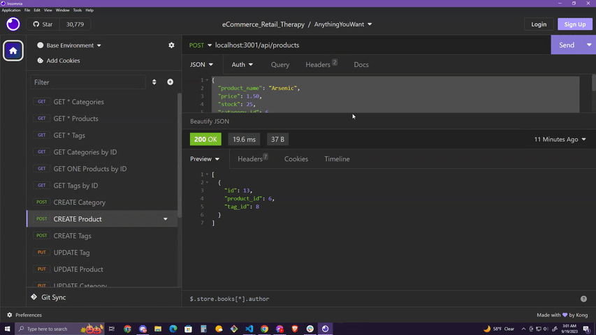

# e*Commerce Retail Therapy

## Table of Contents: 
### [Table of Contents](#table-of-contents-table-of-contents)
### [Description](#description)
### [Usage](#usage)

## Description:
This application is built for backend use for an internet retail website. Users will be able to retrieve, create, update, and delete information pertaining to their products. 

We were tasked to modify starter code and create a working Express.js API to use Sequelize to interact with a MySQL database.

Since we are not deploying this application, here is a [Walkthrough Video](https://drive.google.com/file/d/1R0i9ljuMOftNHY0bLLTIDRTyQZn9rSQX/view) that demonstrates the functionality of the app.

If you would like a preview of the walkthrough, please see gifs below.

## Usage: 

You will need to use [VS Code](https://code.visualstudio.com/download) and a test API program like [Insomnia](https://insomnia.rest/download).

## Tests: 

*Use the `schema.sql` file in the `db` folder to create the database within the shell commands. 

*Use `npm run seed` to fill the database with the appropriate data in the seed files.

* Use `npm start` to connect to a port and test requests in Insomnia.

## GitHub Links: 
### [charmingdarling](https://github.com/charmingdarling)

### [GitHub Repo - ECommerce - Retail Therapy](https://charmingdarling.github.io/ecommerce_retailtherapy/)

## Questions: 
You may reach me at h1hasinai_f06@yahoo.com for any questions regarding this project.

# ecommerce_retailtherapy
